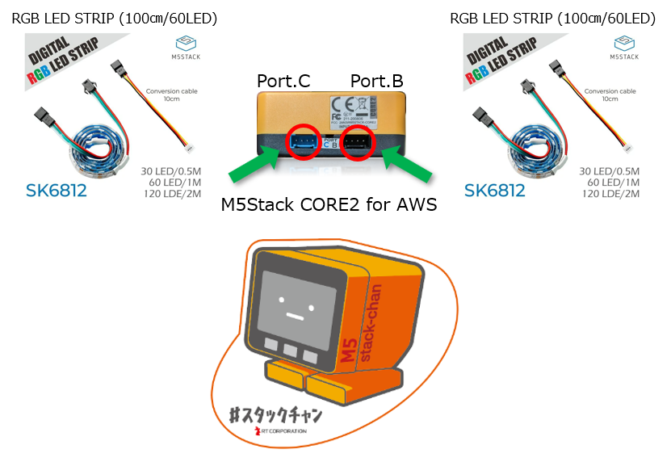
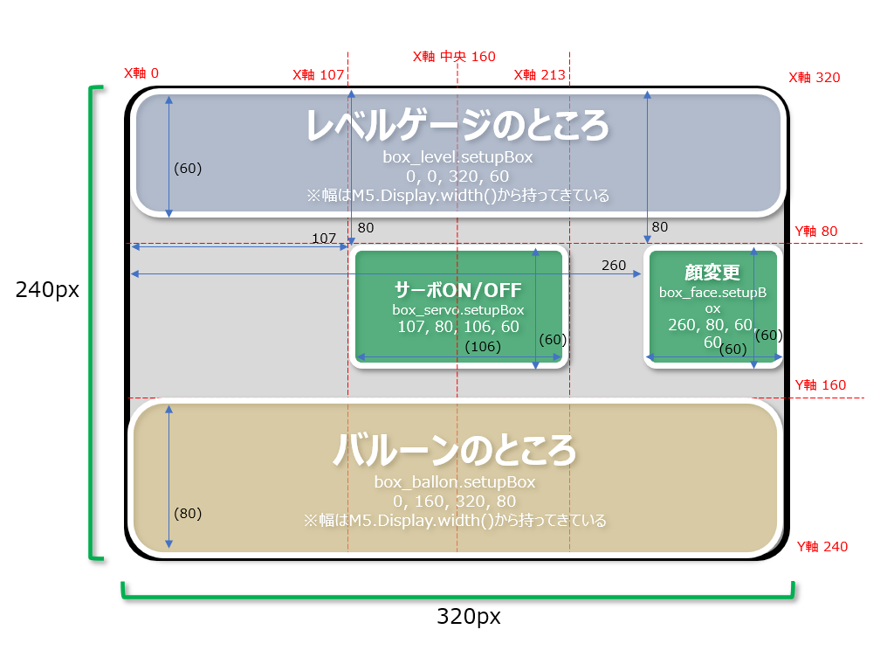
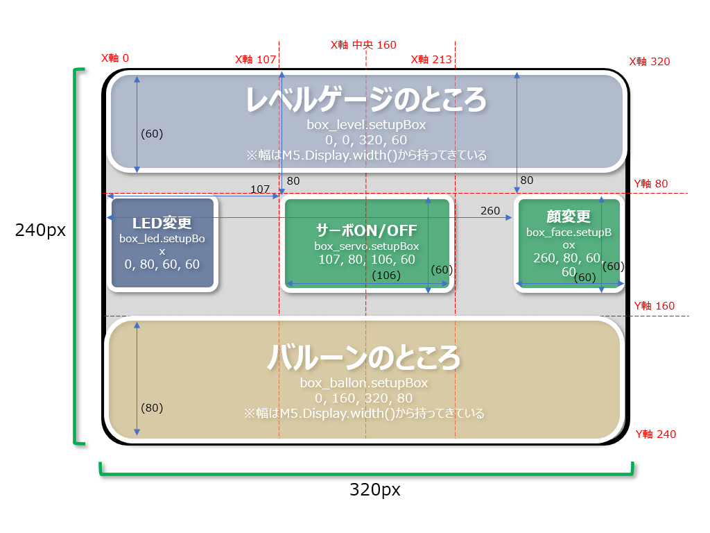
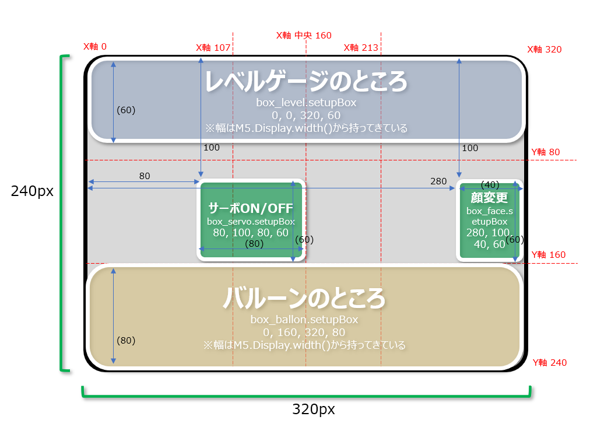

# stackchan-bluetooth-simple

---
## 2023年11月28日:
日本でM5Stack CORE2 Ver1.1が発売となり、チップセット構成が変わりました。そのため、ライブラリを最新の【M5Unified 0.1.11】に変更し、稼働対応しました。 

## 2023年11月18日:
オリジナルのエフェクトを追加しました。しかしながら…私自身プログラマではないため、洗練されたエフェクトコードは書けないっすｗｗｗ 
何か不具合等があれば教えてください。 

### エフェクト設定:
起動時:RAINBOW ⇒ COMET ⇒ LARSON ⇒ CHASE ⇒ PULSE ⇒ STATIC ⇒ FILLIN ⇒ GLOW ⇒ STOROBE ⇒ SINEWAVE ⇒ RANDOM ⇒ TRIWAVE ⇒ NONE(一旦停止) ⇒ FADEINOUT ⇒ NANAIRO ⇒ MERAMERA ⇒ FIRE ⇒ BOUNCING ⇒ NONE(一旦停止) ⇒ RAINBOW…  

### ｽﾀｯｸﾁｬﾝの構成:
スイッチサイエンス等で販売しているM5Stack純正部品 RGB LED STRIP (100cm/60LED) SK6812を用いて動作確認をしています。 
 

## 2023年11月版: 追加LEDエフェクト名称および有効パラメータ
| Name | Range | AoE | Delay | Color | Looping | Direction | Description |
| ----: | :-----: | :-----: |  :---: | :-----: | :-------: | :---------: | :--- |
| [FADEINOUT](https://youtube.com/shorts/7j3RzVZ8V8k?feature=share) | N | N | N | Y | N | Y | LEDがフェードインアウトするエフェクト (色固定) |
| [NANAIRO](https://youtube.com/shorts/aiBonRR6LJo?feature=share) | N | N | N | N | N | Y | LEDがフェードインアウトするエフェクト(七色順番に点灯) |
| [MERAMERA](https://youtube.com/shorts/TvK8jyE4r2A?feature=share) | N | N | N | N | N | N | メラメラと燃えるようなエフェクト |
| [FIRE](https://youtube.com/shorts/ndaVecUnqKE?feature=share) | N | N | N | N | N | N | 炎が立ち上がるようなエフェクト |
| [BOUNCING](https://youtube.com/shorts/cLRLQNVqUdE?feature=share) | N | Y | N | Y | N | N | ボールが弾むようなエフェクト(ボールは最大3つまで) |

※LoopingがNoであっても繰り返し動作します。

## 2023年7月17日:
中央左側(青部)をタップすることで、LEDエフェクトを可変できるように修正しました。起動時の初期値はRAINBOWWAVEとし、タップ毎に下記順番で変化させることができます。 
### COMET ⇒ LARSON ⇒ CHASE ⇒ RAINBOWWAVE ⇒ STROBE ⇒ RANDOM ⇒ TALKING

| 変更前のレイアウト              | 変更後のレイアウト (LEDエフェクトボタン追加) |
| ----------------------------- | ----------------------------- |
|  |  |

## 2023年7月16日:
画面中央のサーボON/OFF機能、中央右側の顔(FACE)変更機能のボタンの大きさと配置を修正しました。 

| 変更前のレイアウト              | 変更後のレイアウト              |
| ----------------------------- | ----------------------------- |
|  |  |

## 2023年7月6日:
Grove Port.BおよびPort.Cを用いてLEDユニットを増設しエフェクトさせるための記述を追加しました。必要な際には[main.cpp](https://github.com/ToshihiroMakuuchi/stackchan-bluetooth-simple/blob/dev/src/main.cpp)ソース内の75～90行目(Port.B)、もしくは93～108行目(Port.C)のコメントアウトを外してご利用ください。 
また、805行目のLEDの明るさ設定(FastLED.setBrightness)は細心の注意を払い数値設定してください。 
※現在の設定は【30】としています。明るさ設定の行をコメントアウトしたり極端な高い値に設定しますと、利用するLEDの仕様により意図しない発熱やM5Stack本体への負荷が高くなり故障の原因となる場合がありますのでご注意ください。 
 
稼働ハードウェアは【M5Stack Core2 for AWS】もしくは【M5Stack Core2＋M5GoBottom2】を想定しています。

## 2023年5月12日:
フォーク元となる[robo8080](https://twitter.com/robo8080)さんにより、音量が小さいままの問題が対策されました。そちらの修整部分を今回マージしています。

## 2023年4月30日:
main.cppで1つ、NeoPixelEffectsで2つの警告メッセージが出ていたものを修正しました。 
(関数非推奨となったところの修正、およびNULLの取扱い方を変更) 
またNeoPixelEffects.h内で設定されるエフェクトを取り扱う変数名を【Effect⇒EffectType】に変更しました。

## 2023年4月22日:
robo8080さんの『stackchan-bluetooth-simple』をフォークし、FastLEDライブラリ＋[NeoPixelEffects](https://github.com/nolanmoore/NeoPixelEffects)を組み合わせました。 

[robo8080](https://twitter.com/robo8080)さんのソースは、[タカオ(Takao)](https://twitter.com/mongonta555)さんの ｽﾀｯｸﾁｬﾝ Arduinoファームウェア『stackchan-bluetooth-simple』にレベルメーターやFaceチェンジ機能を追加したものです。(稼働ハードウェアはCore2、Core2 for AWSのみ) 

robo8080さんが公開している現時点のソースは下記となります。 
<https://github.com/robo8080/stackchan-bluetooth-simple> 
タカオさんオリジナルソースは下記となります。 
<https://github.com/mongonta0716/stackchan-bluetooth-simple> 

どーもくん (C)NHK・TYO の画像を選択することができます。 

### 使い方 ###
* このソースを用いてVSCode＋PlatformIO環境でビルドすると、M5Stack Core2 for AWS、またはM5Stack Core2にM5GoBottom2を追加し、Lチカ処理を直ぐに確認することができます。 
  (変更は下記並びに[main.cpp](https://github.com/ToshihiroMakuuchi/stackchan-bluetooth-simple/blob/dev/src/main.cpp)ソース内コメントをご確認ください)
* Core2 for AWSやM5GoBottom2のLEDバーの使用するデータピンは【25】が用いられ、またLED球は10個搭載されています。
* Bluetoothモード時レベルメーターを表示できます。
* レベルメーター表示部にタッチすると、レベルメーター表示をON/OFFできます。 
* レベルメーター表示OFFの時、画面下部にタッチするとバルーンで曲名を表示します。 
* 画面右端の中央付近にタッチするとFaceを切り替えられます。 
* 画面中央にタッチすると首振りを止めます。  

## LEDエフェクト名称および有効パラメータ
| Name | Range | AoE | Delay | Color | Looping | Direction | Description |
| ----: | :-----: | :-----: |  :---: | :-----: | :-------: | :---------: | :--- |
| [COMET](https://youtube.com/shorts/wfuuhPH90M0?feature=share) | Y | Y | Y | Y | Y | Y | LED光が尾をを引き設定範囲内を移動する流れ星エフェクト |
| [LARSON](https://youtube.com/shorts/xl6u4YCUk-E?feature=share) | Y | Y | Y | Y | Y | Y | LED光が設定範囲内を往復するエフェクト(ナイトライダー風) |
| [CHASE](https://youtube.com/shorts/lTgBS9gDuDU?feature=share) | Y | ? | Y | Y | N | Y | LEDを1つおきに交互に点滅させるエフェクト(工事現場風) |
| [PULSE](https://youtube.com/shorts/MnvrJHH7iWk?feature=share) | Y | N | Y | Y | Y | N | LEDがゆっくり全点灯、ゆっくり全消灯するフェードインアウトなエフェクト |
| [STATIC](https://youtube.com/shorts/SkdqZ1L5pXA?feature=share) | Y | N | Y | Y | N | N | 同色がチラチラと点滅するキラキラ系エフェクト |
| FADE | Y | N | Y | N | N | N | 設定範囲内でフェードアウトし、全消灯後停止 |
| [FILLIN](https://youtube.com/shorts/7DqiyXPoloc?feature=share) | Y | N | Y | Y | N | Y | 端から1つずつ点灯し、最後は全点灯するエフェクト(全点灯で停止) |
| [GLOW](https://youtube.com/shorts/g3MVGf1shLo?feature=share) | Y | Y | Y | Y | N | N | 設定範囲中央からぼんやりと端に向かい点灯後、中央に戻るエフェクト(ランダム) |
| [RAINBOWWAVE](https://youtube.com/shorts/pfN8k_zY_gs?feature=share) | Y | N | Y | N | N | Y | 動的レインボーグラデーションエフェクト |
| [STOROBE](https://youtube.com/shorts/o3IekoJ9uqQ?feature=share) | Y | N | Y | Y | N | N | 設定範囲内でのストロボエフェクト(定期的に全LEDピカピカ) |
| [SINEWAVE](https://youtube.com/shorts/jg9CFqpYKt8?feature=share) | Y | N | Y | Y | N | Y | 設定範囲内のLED数だけ消灯しながら流れるエフェクト(COMETの逆イメージ) |
| [RANDOM](https://youtube.com/shorts/UXPfDr1h17c?feature=share) | Y | N | Y | N | N | N | LED全部がランダムに点灯するパレード(パリピ)エフェクト |
| TALKING | Y | N | Y | Y | N | N | ロボットのリップシンクのようなエフェクト |
| [TRIWAVE](https://youtube.com/shorts/1XiYPaHgBAA?feature=share) | Y | N | Y | Y | N | Y | LEDが1つずつ消灯しながら流れるエフェクト(COMETの逆イメージ) |
| [FADEINOUT](https://youtube.com/shorts/7j3RzVZ8V8k?feature=share) | N | N | N | Y | N | Y | LEDがフェードインアウトするエフェクト (色固定) |
| [NANAIRO](https://youtube.com/shorts/aiBonRR6LJo?feature=share) | N | N | N | N | N | Y | LEDがフェードインアウトするエフェクト(七色順番に点灯) |
| [MERAMERA](https://youtube.com/shorts/TvK8jyE4r2A?feature=share) | N | N | N | N | N | N | メラメラと燃えるようなエフェクト |
| [FIRE](https://youtube.com/shorts/ndaVecUnqKE?feature=share) | N | N | N | N | N | N | 炎が立ち上がるようなエフェクト |
| [BOUNCING](https://youtube.com/shorts/cLRLQNVqUdE?feature=share) | N | Y | N | Y | N | N | ボールが弾むようなエフェクト(ボールは最大3つまで) |
| NONE | N | N | N | N | N | N | エフェクトの停止 |

---

日本語 | [English](README_en.md)

# 概要

FastLEDライブラリ＋NeoPixelEffectsライブラリを搭載し、簡単にエフェクト機能を使えるようにしました。
M5Stack-AvatarをベースにシンプルにBluetoothスピーカー機能とスタックチャンのサーボコントロール機能をつけました。
[M5Unified](https://github.com/m5stack/M5Unified)のexampleであるBluetooth_with_ESP32A2DPをベースに改造しています。

# 開発環境
- VSCode
- PlatformIO

# 対応機種

- ~~M5Stack Basic/Gray/M5Go BasicはFlashメモリが16MBの機種のみです。~~

- ~~M5Stack Fire~~

- M5Stack Core2 / Core2 for AWSIoT

# 必要なライブラリ
Arduino-ESP32は2.0.4(Fireのみ2.0.0)で動作確認しています。~~M5Stack Fireはarduino-esp32v2.0.4だと不具合があり起動しません。~~

詳しいバージョンについては[platformio.ini](https://github.com/ToshihiroMakuuchi/stackchan-bluetooth-simple/blob/dev/platformio.ini)をご覧ください。

- [M5Stack-Avatar](https://github.com/meganetaaan/m5stack-avatar)

- [ServoEasing](https://github.com/ArminJo/ServoEasing)

- [ESP32Servo](https://github.com/madhephaestus/ESP32Servo)

- [M5Unified](https://github.com/m5stack/M5Unified)

- [ESP8266Audio](https://github.com/earlephilhower/ESP8266Audio)

- [ESP32-A2DP](https://github.com/pschatzmann/ESP32-A2DP)

- [ArduinoJson](https://github.com/bblanchon/ArduinoJson)

- [YAMLDuino](https://github.com/tobozo/YAMLDuino)

- [FastLED](https://github.com/FastLED/FastLED)

- [NeoPixelEffects](https://github.com/nolanmoore/NeoPixelEffects) 
NeoPixelEffectsに関してのcppファイル、hファイルは直接src以下に保存します。

# コンパイル時の注意

- ~~M5Stack Fire V2.6/M5Stack Basic V2.6 TFカードを使用する際にSD.begin()を20MHz以上では読み込めない事象を確認しました。15MHzに下げています。~~

- ~~M5Stack Basic V2.6 VSCode+PlatformIOでコンパイルするときのenvは`env:m5stack-grey`を選択してください。~~

# 設定
SDカードに設定用のYAMLファイルがないとデフォルト値を利用します。（PortAへサーボを接続する設定になっています。）
SDカードに`/yaml/SC_Config.yaml`を配置すると自分の設定が利用できます。

**2022/10/18にJSONからYAMLへ変更しました。JSONからYAMLへのコンバートは[JSON から YAML コンバータ](https://www.site24x7.com/ja/tools/json-to-yaml.html)にて可能です。** コメントの扱いが変わっているので注意してください。

詳しくは[YAMLファイル](https://github.com/mongonta0716/stackchan-bluetooth-simple/blob/main/data/yaml/SC_Config.yaml)を参照してください。

## 設定項目
(カッコ内)は初期値
- servo
    - pin
        - x(Core1 22, Core2 33)  X軸のGPIOを指定
        - y(Core1 21, Core2 32)  Y軸のGPIOを指定
    - offset サーボの軸が90°にしたときにズレを修正するパラメータ
        - x(0)  X軸のオフセット値を設定 (私の場合はズレていて+9しています)
        - y(0)  Y軸のオフセット値を設定 (私の場合はズレていて+7しています)

    - speed 待機時とBluetoothスピーカーで音が出ているときの待機時間とサーボの移動時間を指定します。最小値と最大値で範囲を指定して、ランダムの値を使用します。
        - normal_mode
             - interval_min(5000)
             - interval_max(10000)
             - move_min(500)
             - move_max(1500)
        - sing_mode
             - interval_min(1000)
             - interval_max(2000)
             - move_min(500)
             - move_max(1500)
- bluetooth
    - device_name(M5Stack_BTSPK) Bluetoothスピーカーのデバイス名を指定します。
    - starting_state(false) 起動時にBluetoothモードにするかどうかを指定します。
    - start_volume(100) Bluetoothスピーカーの初期値を設定

- auto_power_off_time(0) Core2のみ。USBの電源供給がOFFになったあと設定した時間が経過すると電源OFFになります。（0は電源OFFしない）

- balloon 吹き出しの設定をします。
    - font_language("JA") フォントの言語を指定します。"JA"か"CN"、指定しないとラテンフォントを使用します。
    - lyrics("こんにちは",”Hello”,"你好","Bonjour") ノーマルモード時にランダムで表示するセリフを設定します。最大10個まで。

# 使い方

- BtnA Bluetoothモードに入ります。(bluetooth_mode = falseの時のみ有効) 

- BtnB 音量を下げます。

- BtnC 音量を上げます。

# Credit
- [meganetaaan](https://github.com/meganetaaan)
- [lovyan03](https://github.com/lovyan03/LovyanGFX)
- [robo8080](https://github.com/robo8080)
- [tobozo](https://github.com/tobozo)
- [ToshihiroMakuuchi](https://github.com/ToshihiroMakuuchi)

# LICENSE
[MIT](LICENSE)

# Author
[Takao Akaki](https://github.com/mongonta0716)

